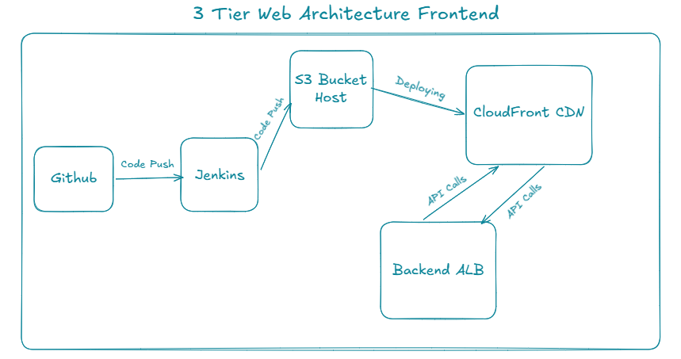

# 🚀 AWSLearn — Frontend

<div align="center">


### 🌐 AWS Learning Platform Frontend

A modern React application deployed on AWS using Amazon S3, CloudFront, and Jenkins CI/CD as part of a complete 3-Tier Architecture.

[⚙️ Backend Repository](https://github.com/Sudipto-Acharya/3rd-Tier-Architecture-Backend) • [👨‍💻 Portfolio](https://sudipto-acharya.vercel.app)

</div>

---

## 📌 Table of Contents

* About the Project
* Architecture
* Features
* Tech Stack
* Local Development
* Environment Variables
* Build & Deployment
* CI/CD Pipeline
* Project Structure
* Author

---

# 📖 About the Project

AWSLearn is a cloud learning platform designed to help students understand AWS services through structured learning content, progress tracking, and community engagement.

This repository contains the frontend application built with React.

### Key Features

* 📚 AWS Learning Modules
* 🔐 User Authentication
* 📈 Learning Progress Tracking
* 💬 Community Q&A Interface
* 🎨 Responsive User Interface
* ⚡ Fast Content Delivery via CloudFront
* 🚀 Automated CI/CD Deployments

---

# 🏗️ AWSLearn Frontend Deployment Architecture

<p align="center">
  
</p>

### Infrastructure Overview

```text
Developer
    │
    ▼
GitHub Repository
    │
    ▼
Jenkins CI/CD
    │
    ▼
Amazon S3
    │
    ▼
CloudFront CDN
    │
    ▼
Users

CloudFront
    │
    ▼
Backend Application Load Balancer
```

### Deployment Process

1. Developer pushes code to GitHub.
2. Jenkins automatically triggers the build pipeline.
3. React application is built using production configuration.
4. Build artifacts are uploaded to Amazon S3.
5. CloudFront cache is invalidated.
6. Updated application becomes available globally.
7. API requests are routed to the backend infrastructure.

---

# ✨ Features

## Learning Experience

* AWS Service Catalog
* Service-Based Learning Topics
* Structured Learning Journey
* Progress Tracking Dashboard

## Community

* Question & Answer System
* Community Interaction
* User Engagement Features

## Frontend Experience

* Responsive Design
* Dynamic Routing
* API Integration
* Component-Based Architecture
* Environment-Based Configuration

---

# 🛠️ Tech Stack

| Category           | Technology        |
| ------------------ | ----------------- |
| Frontend Framework | React.js          |
| Language           | JavaScript (ES6+) |
| Routing            | React Router      |
| API Communication  | Axios             |
| Styling            | CSS3              |
| State Management   | React Hooks       |
| Hosting            | Amazon S3         |
| CDN                | Amazon CloudFront |
| CI/CD              | Jenkins           |
| Source Control     | GitHub            |

---

# 🚀 Local Development

## Prerequisites

* Node.js v18+
* npm v9+

---

## Clone Repository

```bash
git clone https://github.com/your-username/your-frontend-repository.git

cd your-frontend-repository
```

---

## Install Dependencies

```bash
npm install
```

---

## Create Environment File

Create:

```bash
.env.development
```

Add:

```env
REACT_APP_API_URL=http://localhost:5000
```

---

## Start Development Server

```bash
npm start
```

Application runs at:

```text
http://localhost:3000
```

---

# 🔐 Environment Variables

### Development

```env
REACT_APP_API_URL=http://localhost:5000
```

### Production

```env
REACT_APP_API_URL=https://<backend-api-domain>
```

| Variable          | Description          |
| ----------------- | -------------------- |
| REACT_APP_API_URL | Backend API Endpoint |

---

# 📦 Production Build

Create an optimized production build:

```bash
npm run build
```

Generated files are stored inside:

```text
build/
```

---

# ☁️ Deployment

### Upload Build to Amazon S3

```bash
aws s3 sync ./build s3://<your-s3-bucket-name> --delete
```

### Invalidate CloudFront Cache

```bash
aws cloudfront create-invalidation \
  --distribution-id <cloudfront-distribution-id> \
  --paths "/*"
```

---

# ⚙️ CI/CD Pipeline

The project uses Jenkins Freestyle CI/CD for automated deployments.

```text
Developer Pushes Code
          │
          ▼
GitHub Repository
          │
          ▼
GitHub Webhook
          │
          ▼
Jenkins CI/CD
          │
          ▼
npm install
          │
          ▼
npm run build
          │
          ▼
Amazon S3 Deployment
          │
          ▼
CloudFront Cache Invalidation
          │
          ▼
Production Release ✅
```

### Jenkins Environment Variables

| Variable           | Description                |
| ------------------ | -------------------------- |
| REACT_APP_API_URL  | Backend API URL            |
| AWS_REGION         | AWS Deployment Region      |
| S3_BUCKET          | S3 Bucket Name             |
| CLOUDFRONT_DIST_ID | CloudFront Distribution ID |

---

# 📂 Project Structure

```text
frontend/
│
├── public/
│   ├── index.html
│   └── favicon.ico
│
├── src/
│   ├── assets/
│   ├── components/
│   ├── pages/
│   ├── services/
│   ├── App.js
│   └── index.js
│
├── .env.development
├── .env.production
├── package.json
├── package-lock.json
└── README.md
```

---

# 🎯 Skills Demonstrated

* React.js Development
* Component-Based Design
* REST API Integration
* Amazon S3 Static Website Hosting
* Amazon CloudFront CDN
* Jenkins CI/CD Automation
* GitHub Webhooks
* Production Deployment Practices
* AWS Architecture Design

---

# 📄 Related Repositories

| Repository | Description                             |
| ---------- | --------------------------------------- |
| Frontend   | React + S3 + CloudFront                 |
| Backend    | Node.js + Express + Docker + PostgreSQL |

---

## 👨‍💻 Author

**Sudipto Acharya** — DevOps Engineer

[](https://github.com/Sudipto-Acharya)
[](https://www.linkedin.com/in/sudipto-acharya-8a3027258/)
[](https://medium.com/@sudiptoacharya))
[](https://sudipto-acharya.vercel.app/)

---

<div align="center">

### ⭐ If you found this project useful, consider giving it a star.

Built with React, AWS, CloudFront, Jenkins and modern DevOps practices.

</div>
